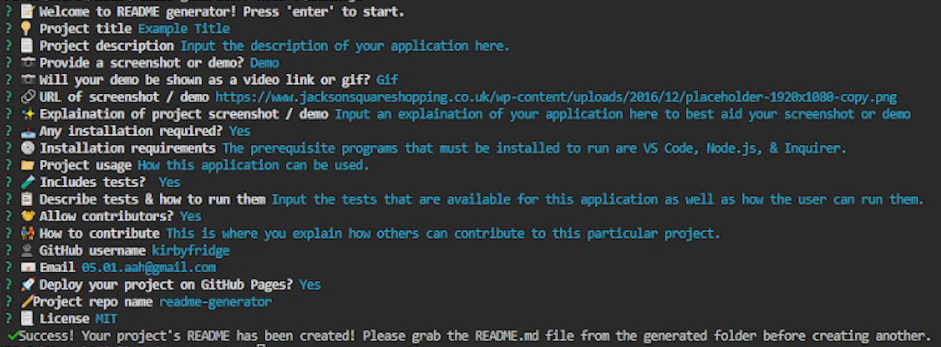

# README Generator

 
 
 
 


## Description

This README generator creates a professional README.md file for any application using Node.js & Inquirer. 
From a series of simple questions about the user & their current project, this commandline-based application 
takes this information & creates a well-structured & clear README that includes a title, description, table 
of contents, screenshot / demo, installation, usage, tests, contributing, questions, GitHub Pages, & 
license. Just open README Generator in VS Code (or directly within Node.js), open up the terminal, & input 
"node .\index.js" to start! 


## Table of Contents

- [Demo](#Demo) 
- [Installation](#Installation)
- [Usage](#Usage)  
- [Questions](#Questions)  
- [License](#License)


## Demo

I provided an easy step-by-step walkthrough of this application & how to use it. Click the link below to watch. 

  🔗 https://youtu.be/RD45WMRiM1s

  


## Installation

The prerequisite programs that must be installed to run are VS Code, Node.js, & Inquirer. 

Within the terminal, input the following: 

  ```
  npm init
  ```

  ```
  npm i inquirer@8.2.4
  ```
  
  
## Usage

README Generator is a command-line application that generates a professional README file using the user's input. 
The user answers a few simple questions about their application in order to easily & efficiently create a great 
README every time. It can be used to create README files for various types of projects. Open up VS Code with this 
application, open up the terminal, & input "node .\index.js" to start. Note, some fields are required to be filled 
out by the user. This in order to make the thorough & clear README file as possible. If a field is required, when 
attempting to skip by pressing enter, the user will be prompted to enter that certain field again. Other options 
are optional, in which the user can skip them by answering "N" or "None" depending on the question. These optional 
sections will be hidden on the final README file when created. When all the questions have finished, it will create 
your personalized file within the "generated" folder. Make sure to take this file & import it into your project 
before creating another or else it will be overwritten. 


## Questions

Got any questions about this application? Contact me!

Github: 
🔗 https://github.com/kirbyfridge/

Email: 
🔗  05.01.aah@gmail.com


## License

  This application is covered by the MIT license.  